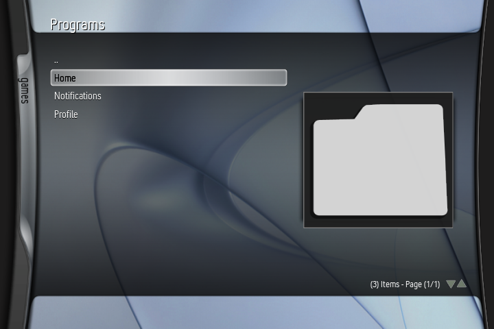
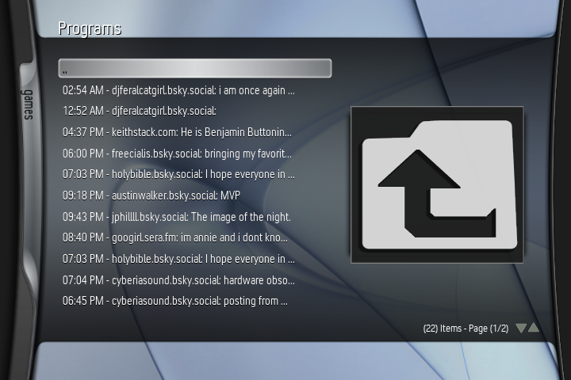
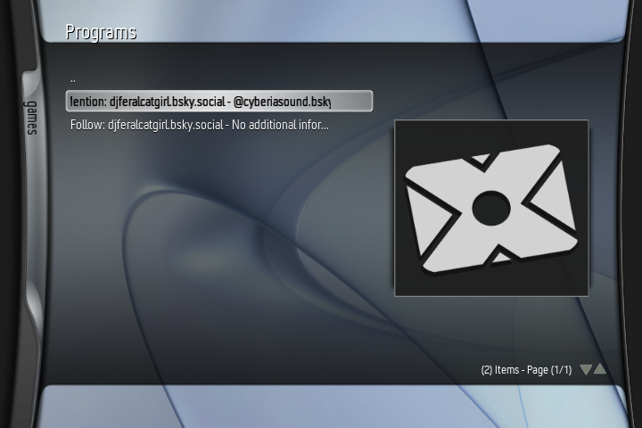
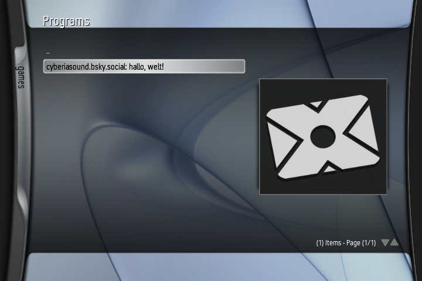
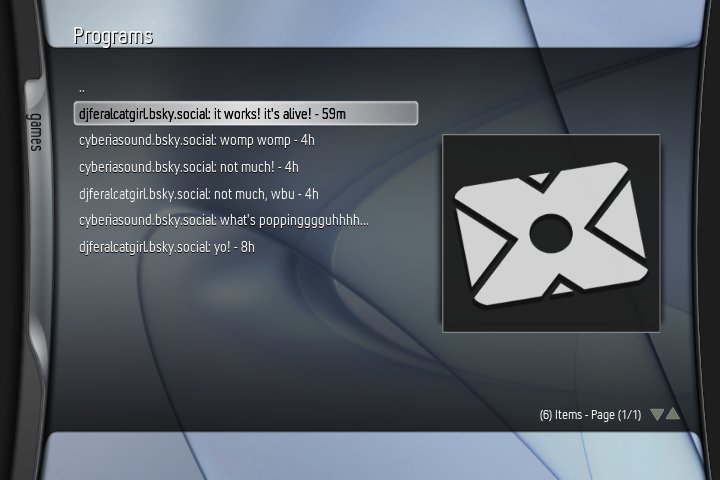

# xSky - Bluesky / AT Protocol client for XBMC4Xbox

A functional, decentralized and easy to use social media network, right on your Xbox.

## Screenshots:

## Install:
- Before downloading, make sure you're on XBMC 3.6-DEV-r33046 or later, as this most likely requires up to date TLS/SSL libraries!
- Download latest release .zip
- Extract the .zip file and edit "login.txt" to contain your full username (ie; username.bsky.social or username.custom.domain) and app password (do not use your actual password!)
- Edit "default.py" and modify "TIMEZONE_OFFSET = -5" to your local timezone relative to UTC (-5 is EST) for accurate timestamps
- Copy the xSky folder to Q:/scripts/plugins/programs
- (Optional) if using a non-Bluesky AT protocol site, you'll have to modify the BASE_URL in default.py to point at that site! Support outside of Bluesky is entirely unsupported, but testing & contributing is encouraged!
- Run the add-on and enjoy!

## Working:
- Logging in (via inserting your credentials into login.txt)
- Viewing Home feed
- Viewing notifications
- Viewing profile
- Viewing Followers / Following + user profiles
- Making text/image posts
- Viewing posts as list items + dialog windows
- Viewing last message in current conversations
- Tagging users and hashtags in posts

## Not Working:
- Viewing Images / Videos / Thumbnails
- Search
- Feeds / Lists
- Chat (currently read-only and only shows the last message received in a conversation)

## TODO:
- Improve visual language (try to match 1:1 to the Bluesky website where possible)
- Add notification / chat indicators (ie; "Chat (5)" / "Notifications (2)"
- Add profile information (ie; name + avatar - bio) as first 2 options when viewing a profile
- Add some way to differentiate between a post and a reply
- Add "Follow / Unfollow User", "Block User" & "Reply to User" as context menu options
- Add sent/received indicator in messages
- Add reply chains(?)
- Store login data somewhere that isn't just a plaintext file?
- [Find a way to leverage Bluesky's chat functionality for an IM service(?)](https://github.com/faithvoid/plugin.programs.xchat)
- Show user avatar as thumbnail if the image doesn't contain media(?)
- Add notification system that alerts the user as to whenever they get a reply / follow / message while outside of the plugin (this will probably have to be it's own plugin)
